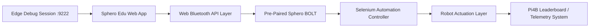

# SpheroBolt - Stateful IoT Robotics Automation System

[Python](https://python.org) • [Selenium](https://selenium.dev) • [Microsoft Edge](https://microsoft.com/edge) • [IoT Systems](https://sphero.com) • [GPL-3.0 License](LICENSE)

---

## 📌 Executive Summary

This project demonstrates a **state-preserving IoT automation architecture** that integrates:

- Sphero BOLT robotic platform  
- Web-based control interface (Sphero Edu)  
- Browser automation via Selenium WebDriver  
- Microsoft Edge persistent debugging sessions  
- Real-time telemetry and leaderboard integration (Pi4B systems)

### Core Engineering Insight

> Reliable IoT automation is achieved not by increasing control complexity, but by preserving system state across execution boundaries.

---

## 🎯 System Objective

To design a **stable, repeatable, and low-latency robotic control system** capable of:

- Eliminating Bluetooth reconnection instability
- Maintaining persistent web control sessions
- Enabling deterministic automation via Selenium
- Supporting real-time feedback loops (robot → web → leaderboard)

---

## 🧠 Architectural Concept



---

## ⚙️ System Design Philosophy

### 1. Stateful Automation Model

Traditional automation fails in IoT contexts due to repeated system resets.  
This system instead implements:

- Persistent browser sessions
- Reused Bluetooth pairing state
- Non-destructive automation cycles

---

### 2. Control Layer Separation

| Layer | Responsibility |
|------|---------------|
| Hardware Layer | Sphero BOLT robot execution |
| Connectivity Layer | Web Bluetooth pairing |
| Application Layer | Sphero Edu web interface |
| Automation Layer | Selenium WebDriver control |
| Debug Layer | Edge DevTools Protocol |

---

## 🚀 Quick Start

### Prerequisites

- Python 3.8+
- Microsoft Edge (Chromium)
- Sphero BOLT (charged + paired capability)
- Bluetooth enabled system

---

### 1. Launch Persistent Edge Session

```bash
"C:\Program Files (x86)\Microsoft\Edge\Application\msedge.exe" --remote-debugging-port=9222
```

Then:
- Navigate to: https://edu.sphero.com  
- Perform **manual one-time pairing** of Sphero BOLT  
- Confirm stable connection (green LED state)

---

### 2. Deploy Automation Stack

```bash
git clone https://github.com/Willxxx7/SpheroBolt.git
cd SpheroBolt
pip install -r requirements.txt
python sphero_automation.py
```

---

### 3. System Execution Outcome

- Persistent browser session is reused
- No Bluetooth reinitialisation required
- Robot responds in real time
- State continuity preserved across runs

---

## 🧪 Problem Statement

Initial implementations using standard Selenium exhibited:

- Browser reinitialisation on each execution
- Loss of Bluetooth pairing state
- Re-triggering of device pairing workflow
- High variability in system response

---

## 🔍 Root Cause Analysis

The system failed due to:

> Stateless automation applied to a stateful physical computing system

Key failure chain:

1. Browser restart  
2. JavaScript runtime reset  
3. Bluetooth session teardown  
4. Device re-discovery requirement  
5. Unstable automation loop  

---

## 🛠️ Engineering Solution

### Persistent Debug Session Architecture

By enabling Edge remote debugging:

```bash
--remote-debugging-port=9222
```

The system achieves:

- Shared browser context across automation cycles  
- Persistent Web Bluetooth session retention  
- Stable DOM + JS runtime state  
- Reusable device pairing state  

---

## 📊 System Behaviour Comparison

| Model | Behaviour | Outcome |
|------|----------|--------|
| Stateless Automation | Full reset per run | Unstable |
| Stateful Debug Model | Persistent session reuse | Stable |

---

## 🧩 Technology Stack

### Core Stack
- Python 3.8+
- Selenium WebDriver
- Microsoft Edge (Chromium)

### IoT Stack
- Sphero BOLT (Bluetooth Low Energy)
- Web Bluetooth API
- Sphero Edu Web Platform

### Infrastructure Layer
- Raspberry Pi 4B (leaderboard / telemetry)
- Local automation scripts
- Optional cloud logging (extendable)

---

## 📡 System Characteristics

- **Latency:** Low (pre-paired device state)
- **Reliability:** High (session persistence model)
- **Scalability:** Medium (single-session browser model)
- **Determinism:** High (controlled automation layer)

---

## 🧪 Key Engineering Insights

### 1. State Persistence is a Primary Control Variable
System stability is governed more by state retention than by automation logic.

### 2. Browser Context = Device Stability
Maintaining a live browser session preserves Bluetooth pairing integrity.

### 3. Automation Must Respect OS-Level Boundaries
Selenium operates at DOM level; hardware interaction requires indirect control.

### 4. Debug Interfaces Unlock System Continuity
Remote debugging exposes persistent runtime control surfaces.

---

## 📈 Outcomes

- Stable robotic control loop achieved
- Zero repeated pairing cycles required
- Deterministic automation behaviour established
- Real-time IoT feedback loop operational
- Demonstrable classroom + research deployment model

---

## 🎓 Educational & Research Value

This system demonstrates:

- IoT system architecture design  
- Stateful vs stateless computing models  
- Browser automation limitations and extensions  
- Web Bluetooth interaction constraints  
- Real-world debugging and system recovery strategies  
- Multi-layer distributed control systems  

---

## 🔐 License

GPL-3.0

---

## 🤝 Contribution Model

This project is open for extension in:

- Multi-device robot coordination
- Cloud telemetry integration
- AI-driven motion planning
- Extended sensor fusion systems

---

## 📌 Closing Statement

This project demonstrates that **robust IoT automation is not achieved through increased tool complexity, but through controlled preservation of execution state across all system layers.**
