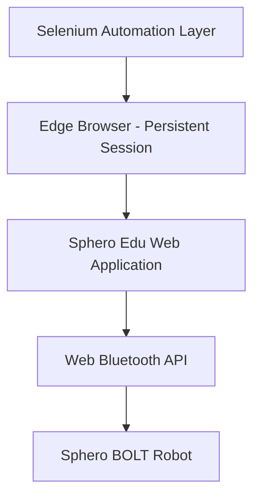

# SpheroBolt - Stateful IoT Automation with Selenium


---

## Overview

This project demonstrates a real-world IoT automation system combining:

- Sphero BOLT robot  
- Sphero Edu web application  
- Selenium browser automation  
- Microsoft Edge persistent debugging sessions  

**Core Insight:**  
Stateless automation fails in stateful IoT systems.  
Reliable control is achieved by preserving system state, not repeatedly rebuilding it.

---

## Table of Contents

- [Quick Start](#quick-start)
- [Main Project](#main-project-python-selenium-iot-automation)
- [Architecture](#architecture)
- [Stateless vs Stateful Comparison](#stateless-vs-stateful-comparison)
- [Technologies Used](#technologies-used)
- [Key Learnings](#key-learnings)
- [Troubleshooting](#troubleshooting)
- [Educational Value](#educational-value)

---

## Quick Start

### Prerequisites

- Node.js (v14 or higher)  
- Python 3.8+  
- Microsoft Edge (Chromium)  
- Sphero BOLT robot  

---

### Installation

#### Clone the repository

```bash
git clone https://github.com/Willxxx7/SpheroBolt.git
cd SpheroBolt
```

#### Install Node.js dependencies

```bash
npm install
```

#### Install Python dependencies

```bash
pip install -r requirements.txt
```

#### Run the project

```bash
node index.js
```

---

### Basic Movement Example (Node.js)

```javascript
const Sphero = require('sphero');

const sphero = Sphero('YOUR_SPHERO_SERIAL');

sphero.color('red');
sphero.roll(100, 90);
```

---

## Main Project: Python/Selenium IoT Automation

### The Problem

Initial Selenium automation resulted in **critical instability**:

- Browser restarted on every run  
- Web application reloaded each time  
- Bluetooth connection workflow repeatedly triggered  
- Device connection dropped or failed  
- Automation became unreliable  

---

### Root Cause

**Stateless automation applied to a stateful IoT system**

Each execution caused:

1. Browser restart  
2. Web app reload  
3. JavaScript runtime reset  
4. Bluetooth reconnection attempt  
5. Pairing workflow restart  

Result: continuous setup loop instead of stable control.

---

### The Solution

Shift from **stateless → stateful automation**

#### Key Implementation

- Launch Edge with remote debugging:

```bash
msedge.exe --remote-debugging-port=9222
```

- Attach Selenium to existing browser session  
- Keep Sphero Edu app running continuously  
- Pair device once and reuse connection  
- Automate only the control layer (UI)  

#### Result

✅ Stable, reliable IoT control  
✅ No repeated pairing cycles  
✅ Persistent device connection  

---

## Architecture



---

## Stateless vs Stateful Comparison

| Approach | Behaviour | Result |
|----------|----------|--------|
| Stateless (Normal Selenium) | Browser restarts, app reloads, Bluetooth reconnects | ❌ Unstable |
| Stateful (Debug Session) | Persistent session, connection reused | ✅ Stable |

---

## Technologies Used

| Component | Technology |
|----------|-----------|
| Scripting | Python, Node.js |
| Automation | Selenium WebDriver |
| Browser | Microsoft Edge (Chromium) |
| Debugging | Edge DevTools Protocol |
| Connectivity | Web Bluetooth API |
| Hardware | Sphero BOLT |
| Interface | Sphero Edu |

---

## Key Learnings

### 1. State Persistence > Tool Complexity
Reliable IoT automation depends on maintaining system state.

---

### 2. Reinitialisation Causes Failure
Repeated resets of browser, application, and device state lead to instability.

---

### 3. Persistent Runtime is Critical
Keeping sessions alive avoids reconnection issues.

---

### 4. Automation Boundaries Matter

- ❌ Restarting browser resets device state  
- ✅ Controlling UI within a live session preserves it  

---

### 5. Real Insight

Automation systems fail not because tools lack capability,  
but because system state is repeatedly destroyed and rebuilt.

---

## Troubleshooting

### Device Issues

- Ensure Sphero is charged and powered on  
- Verify Bluetooth connection in system settings  
- Re-pair device if necessary  

---

### Node.js Issues

```bash
npm cache clean --force
npm install
```

---

### Python Issues

```bash
pip install --upgrade pip
pip install -r requirements.txt --force-reinstall
```

---

### Browser Issues

- Ensure Edge is installed and up to date  
- Check debugging port is available  

```bash
netstat -ano | findstr :9222
```

---

### Persistent Session Issues

```bash
taskkill /F /IM msedge.exe
```

- Restart Edge with debugging enabled  
- Ensure port 9222 is not already in use  

---

## Educational Value

This project demonstrates:

- Stateful vs stateless systems  
- IoT automation challenges  
- Browser vs OS boundaries  
- Web Bluetooth behaviour  
- Real-world debugging strategies  
- Automation architecture design  

---

## License

GPL-3.0

---

## Contributing

Contributions are welcome. Feel free to open issues or submit pull requests.

---

## Contact

GitHub: https://github.com/Willxxx7