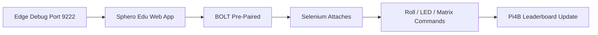

[](https://python.org)
[](https://selenium.dev)
[](https://microsoft.com/edge)
[](https://sphero.com)
[](LICENSE)

# SpheroBolt - Stateful IoT Robot Automation

**Production-grade Sphero BOLT control via Selenium + Edge debug sessions**

---

## 🎯 What It Does



**Key Idea:**  
Pre-connect Sphero BOLT → Selenium attaches to live browser session → No pairing delays

---

## 🚀 Quick Start

### Prerequisites
```
Python 3.8+
Microsoft Edge (Chromium)
Sphero BOLT (charged, Bluetooth enabled)
```

---

### 1. Launch Edge Debug Session

```bash
"C:\Program Files (x86)\Microsoft\Edge\Application\msedge.exe" --remote-debugging-port=9222
```

Then:
- Go to `https://edu.sphero.com`
- Manually pair Sphero BOLT (green LED confirms connection)

---

### 2. Install & Run

```bash
git clone https://github.com/Willxxx7/SpheroBolt.git
cd SpheroBolt
pip install -r requirements.txt
python sphero_automation.py
```

---

### 3. Expected Result

```
Sphero rolls forward
LED matrix displays animation
Pi4B leaderboard updates score
Robot responds in real-time
```

---

## 🏗️ Architecture

```text
Edge Debug Session (Persistent)
        ↓
Sphero Edu Web App (Live Session)
        ↓
Web Bluetooth API (Pre-paired Device)
        ↓
Selenium Automation Layer
        ↓
Sphero BOLT Robot
        ↓
Pi4B Leaderboard System
```

---

## 📊 Stateless vs Stateful Comparison

| Approach              | Behaviour                                      | Result      |
|----------------------|----------------------------------------------|------------|
| Normal Selenium       | Browser restarts each run                    | Unstable   |
| Edge Debug Session    | Persistent browser + reused connection       | Stable     |

---

## 🛠️ Tech Stack

```yaml
Core:
  - Python 3.8+
  - Selenium WebDriver
  - Microsoft Edge (Chromium)

IoT:
  - Sphero BOLT (Bluetooth)
  - Web Bluetooth API
  - Sphero Edu Platform

Infrastructure:
  - Pi4B kiosk leaderboard
  - Local automation scripts
```

---

## 📸 Screenshots (Add These Later)

### Sphero Control Interface
`screenshots/sphero_control.png`

### Edge Debug Session
`screenshots/edge_debug.png`

### Pi4B Leaderboard
`screenshots/pi4b_leaderboard.png`

---

## 🔧 Troubleshooting

### Port 9222 already in use
```bash
netstat -ano | findstr :9222
```
Kill the process and restart Edge.

---

### Sphero not connecting
- Turn robot off/on
- Check Bluetooth pairing
- Ensure Sphero Edu site is open

---

### Selenium not attaching
- Confirm Edge started with:
  `--remote-debugging-port=9222`
- Ensure session is already open before running script

---

## 🎓 Key Engineering Insights

- State persistence is more important than automation complexity  
- Browser session continuity avoids Bluetooth reset cycles  
- Pre-pairing eliminates unstable reconnection logic  
- Real-world IoT systems depend on runtime stability  
- Debug browser sessions expose powerful automation control  

---

## 📈 Outcomes

- Stable robot control via browser automation  
- Zero repeated pairing required  
- Real-time IoT response system  
- Educational IoT + automation demonstration  
- Works as a live classroom engineering model  

---

## 📄 License

GPL-3.0

---

## 🤝 Contributing

Pull requests and improvements welcome.

---

## 📌 Summary

This project demonstrates how **stateful browser automation + IoT devices** can be combined to create reliable real-world robotics control systems using Selenium and Edge debug sessions.
